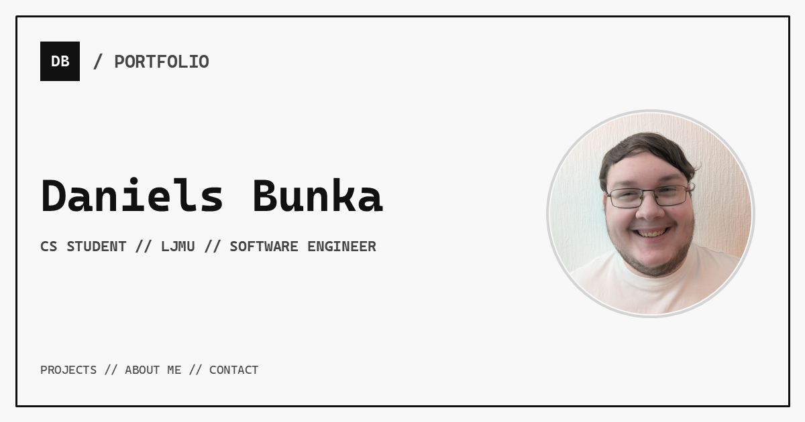

# Daniels Bunka — Portfolio

My personal portfolio website for presenting my software engineering projects, experience and interests. The site combines a minimal terminal-inspired interface with detailed MDX project articles.

[](https://danielsbunka.com)

## Features

- Responsive layouts for desktop and mobile devices
- Interactive profile photograph with selectable hats and moustaches
- Project articles written in MDX with reusable frontmatter
- Project filtering by technology tag
- Expandable experience timeline and image lightbox
- Viewable and downloadable CV
- Per-page metadata, canonical URLs and Open Graph information
- Automatically generated `robots.txt` and sitemap

## Built With

- [Next.js](https://nextjs.org/) using the App Router
- [React](https://react.dev/)
- [TypeScript](https://www.typescriptlang.org/)
- Custom CSS
- [MDX](https://mdxjs.com/) and `next-mdx-remote`
- `gray-matter` for article frontmatter

## Local Development

### Prerequisites

- Node.js 20.9 or newer
- npm

### Setup

```bash
git clone https://github.com/DanielsBunka/danielsbunka.com.git
cd danielsbunka.com
npm ci
npm run dev
```

Open [http://localhost:3000](http://localhost:3000) in your browser.

## Available Scripts

| Command | Purpose |
| --- | --- |
| `npm run dev` | Start the local development server |
| `npm run build` | Create a production build |
| `npm run start` | Run the production build |
| `npm run lint` | Check the project with ESLint |

## Project Articles

Articles are stored as `.mdx` files in `content/projects`. Each file uses frontmatter for the information displayed by the project list and page metadata:

```yaml
---
title: "Project name"
description: "A short description of the project."
tags: ["Technology", "Another Technology"]
github: "https://github.com/username/repository"
projectDate: "YYYY-MM"
publishedAt: "DD-MM-YYYY"
---
```

Adding a new MDX file makes the article available through the projects page using its filename as the URL slug.

## Project Structure

```text
app/                  Pages, layouts and interface components
content/projects/     MDX project articles
lib/                  Metadata, article and tag utilities
public/               Images, decorative assets, CV and social image
```
